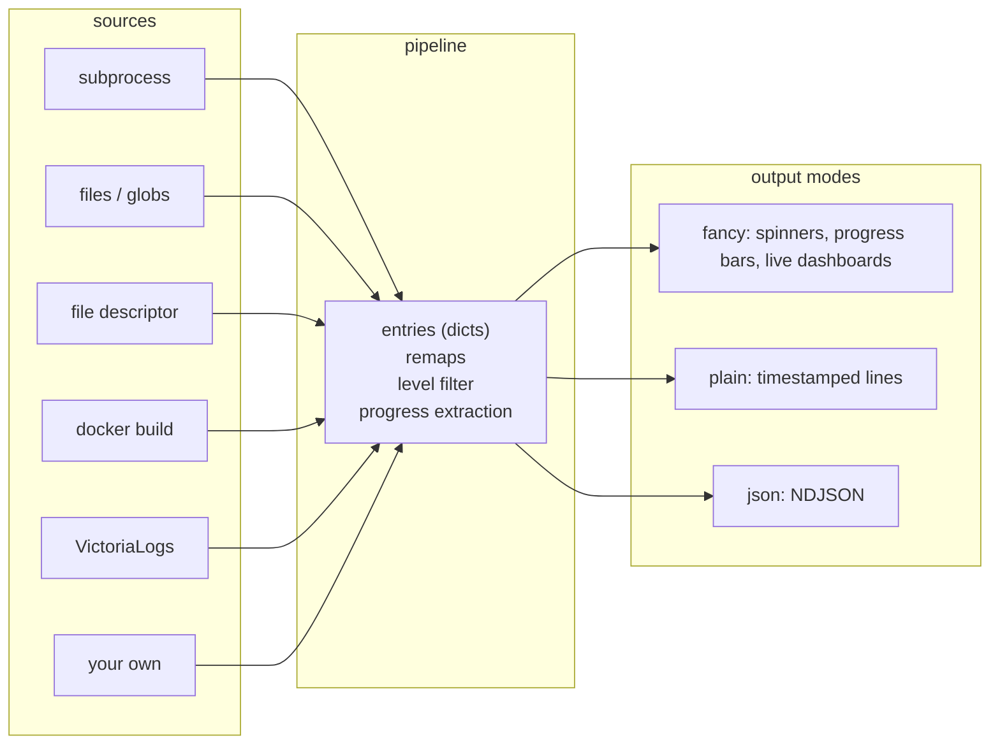

# lograil

`lograil` is a Python library for building great developer experiences around
**streamed and aggregated logs and task statuses**. It takes log entries from
pluggable sources -- subprocesses, files, file descriptors, Docker builds, log
databases, or your own backends -- and renders them through one consistent
pipeline with flexible output: a rich terminal UI when a human is watching,
plain text when piped, and NDJSON when a machine is consuming.

The core idea: tools that orchestrate work (builds, test runs, deploys,
long-lived tails) all need the same plumbing -- a spinner or progress bar while
work is running, permanent lines for things that matter, level filtering, and
sane behavior in CI. `lograil` provides that plumbing once, so a tool's job is
reduced to _producing entries_.



## Installation

```sh
pip install lograil               # core (rich + anyio)
pip install 'lograil[file]'       # file tailing (watchdog)
pip install 'lograil[victoria]'   # VictoriaLogs source (httpx)
pip install 'lograil[docker]'     # Docker SDK helpers
```

## Task statuses

`status()` shows a transient spinner on a TTY, logs a plain line otherwise,
and renders a permanent completion line when the block exits:

```python
from lograil import status, update_status

with status("Compiling", done="compiled"):
    compile_everything()
# fancy: spinner while running, then "+ compiled"

# Structured labels compose a "<process> <subject>" line and derive the
# done message automatically:
with status(process="build", subject="api-server") as handle:
    build()  # spinner: "build api-server"
    handle.update("linking")  # spinner: "linking"
# prints "+ build api-server: done"

# Statuses nest; inner completion lines print above the outer spinner.
with status("deploying", sticky=True):
    with status(process="build", subject="api"):
        ...
    update_status(subject="uploading")  # re-labels the active spinner
```

A status can be flipped to a warning-style completion (used for
cancellation) with `handle.cancel()`.

## Tailing a log source into a status

`tail_to_status()` consumes any `LogSource` on a background thread and
renders its entries through the active status -- transient spinner lines for
chatter, permanent lines for warnings and errors, progress bars for entries
carrying progress metadata:

```python
from lograil import status, tail_to_status
from lograil.sources.file import FileLogSource

source = FileLogSource(["logs/*.log"], read_from="end", tail_lines=20)
with status("Watching deploy", done="deploy finished"):
    with tail_to_status(source=source) as drained:
        wait_for_deploy()  # log lines animate the spinner meanwhile
    if drained.error is not None:
        raise RuntimeError(f"log stream failed: {drained.error}")
```

Entries are plain dicts. `message` and `levelname` are the core keys;
everything else is structured context that survives into JSON output:

```python
{"message": "listening on :8080", "levelname": "INFO", "name": "api"}
```

## Running process groups

`run_process_group()` runs subprocesses concurrently and renders a live
dashboard (spinner, per-process progress, exit markers) in fancy mode, or
interleaved prefixed lines in plain/json mode. One process failing is
recorded in its result instead of taking down its siblings:

```python
from lograil import ProcessSpec, run_process_group

result = run_process_group(
    [
        # These tools report on stdout; ProcessSpec captures stderr by
        # default, so select the stream each process actually writes to.
        ProcessSpec(
            argv=["pytest", "-q"],
            name="tests",
            stream="stdout",
        ),
        ProcessSpec(argv=["ruff", "check", "."], name="lint", stream="stdout"),
        ProcessSpec(argv=["mypy", "src"], name="types", stream="stdout"),
    ],
    cancel_on_failure=False,
)
for proc in result.processes:
    print(proc.spec.label, proc.exit_code, proc.last_message)
if not result.success:
    raise SystemExit(1)
```

While running, the fancy mode shows spinner cells for plain processes
and a bar for anything reporting progress (here, the auto-detected pytest
parser):

```text
processes ✓ lint                         ⠧ types checking

progress  ⠧ tests ━━━━━━━━━───────────  46% tests/test_api.py::test_str…
```

The final frame persists with per-process exit markers:

```text
processes ✓ lint                         ✗ types

progress  ✓ tests ━━━━━━━━━━━━━━━━━━━━ 100%
```

Process output parsers are selected automatically when possible. For example,
`pytest`/`py.test` subprocess uses the built-in pytest parser unless
`parser=...` is set explicitly. Custom parsers can be registered by command
name and should emit the generic `lograil.progress.*` fields when they expose
progress:

```python
from lograil import ProcessSpec, register_output_parser, run_process_group


class SuiteParser:
    def __call__(self, entry):
        if entry.get("message") == "done":
            entry["lograil.progress.description"] = "suite"
            entry["lograil.progress.completed"] = 1
            entry["lograil.progress.total"] = 1
        return entry


register_output_parser(
    "suite",
    SuiteParser,
    command_names=("suite-runner",),
)

run_process_group([ProcessSpec(["suite-runner", "test"])])
```

## Progress reporting from child processes

Children emit machine-readable progress lines on stdout; the parent's tailer
extracts them and renders a progress bar instead of raw text:

```python
# child process
from lograil import emit_progress

for i, item in enumerate(items):
    emit_progress(description=item.name, completed=i, total=len(items))
    handle(item)
```

```python
# parent: opt the child in and let the subprocess source pick lines up
import os
from lograil import ProcessSpec, lograil_instrumentation_env, run_process_group

env = {**os.environ, **lograil_instrumentation_env()}
run_process_group([ProcessSpec(argv=["python", "worker.py"], env=env)])
```

Any source can carry progress the same way: entries annotated with the
`lograil.progress.*` keys (see `lograil.ProgressUpdate`) render as bars.

## Pluggable sources

A source is anything that yields entry dicts. Subclass `LogSource`, pass a
`source_id` to self-register, and every consumer -- `tail_to_status`, the CLI --
can use it:

```python
import threading
from collections.abc import Iterator
from contextlib import closing, contextmanager
from lograil import LogEntry, LogQuery, LogSource, tail_to_status


class KafkaLogSource(LogSource, source_id="kafka"):
    def __init__(self, topic: str) -> None:
        self._topic = topic

    @contextmanager
    def open(
        self, *, stop: threading.Event, query: LogQuery | None = None
    ) -> Iterator[Iterator[LogEntry]]:
        _ = query

        def entries() -> Iterator[LogEntry]:
            for record in consume(self._topic, stop=stop):
                yield {"message": record.value, "name": self._topic}

        with closing(entries()) as handle:
            yield handle
```

Bundled sources:

| source id      | class                                 | reads                                                             |
| -------------- | ------------------------------------- | ----------------------------------------------------------------- |
| `docker-build` | `sources.docker.DockerBuildLogSource` | `docker build` plain/rawjson output, with per-step progress       |
| `fd`           | `sources.fd.FileDescriptorLogSource`  | newline-delimited lines from an fd or stdin                       |
| `file`         | `sources.file.FileLogSource`          | files and glob patterns, rotation-aware (`[file]` extra)          |
| `victoria`     | `sources.victoria.VictoriaLogsSource` | VictoriaLogs live tail with reconnect/resume (`[victoria]` extra) |
| --             | `SubprocessLogSource` (async)         | a subprocess's stdout/stderr streams                              |

Sources own their reconnection policy; an exception escaping `open()` or its
entry iterator is reported once on `TailDrained.error`, never silently retried.

## Output modes and filtering

Output mode is auto-detected -- `fancy` on a TTY, `plain` otherwise -- and can
be forced with `LOGRAIL_OUTPUT=fancy|plain|json`:

- **fancy** -- transient spinners, progress bars, live dashboards; warnings
  and errors always print permanently, even while a progress bar is active.
- **plain** -- timestamped, severity-colored lines; safe for CI logs.
- **json** -- one NDJSON object per entry on stderr, preserving the entry's
  level and structured fields:

  ```json
  {
    "level": "ERROR",
    "logger": "lograil.tail",
    "message": "#5 ERROR: boom",
    "name": "docker-build",
    "timestamp": "2026-07-20T20:16:15+00:00"
  }
  ```

Filtering uses tracing-style directives via the `LOGRAIL` env var (or
`configure_logging()` / the CLI's `--filter`), applied uniformly across all
output modes:

```sh
LOGRAIL=debug                 # everything at debug and above
LOGRAIL=warn                  # warnings and errors only
LOGRAIL=off                   # silence everything
LOGRAIL=warn,lograil.tail=info  # per-target overrides, most specific wins
```

## CLI

The `lograil` command adapts a stream on stdin using any registered source:

```sh
docker build --progress=plain . 2>&1 | lograil --source=docker-build
# fancy TTY: one progress bar per build step; errors printed permanently

tail -f app.log | lograil --source=fd --output=plain
kubectl logs -f deploy/api | lograil --source=fd --output=json --filter=warn
```

`--output` and `--filter` mirror `LOGRAIL_OUTPUT` and `LOGRAIL`.

## Formatting helpers

The entry formatter is usable standalone, e.g. for rendering stored entries:

```python
from lograil import format_log_entry

line = format_log_entry(
    {
        "message": "cache miss",
        "levelname": "WARN",
        "name": "api",
        "timestamp": 1721470000.5,
    },
    context="name",
)
```

`EnvFilter`, `LograilHandler`, and `LograilFormatter` plug into stdlib
`logging` directly if you want lograil's rendering for your own loggers:

```python
import logging
from lograil import configure_logging

logger = configure_logging()  # honors LOGRAIL / LOGRAIL_OUTPUT
logger.info("ready")
```

## License

Copyright 2026 Vercel, Inc.

Licensed under the Apache License, Version 2.0. See [LICENSE](LICENSE).
